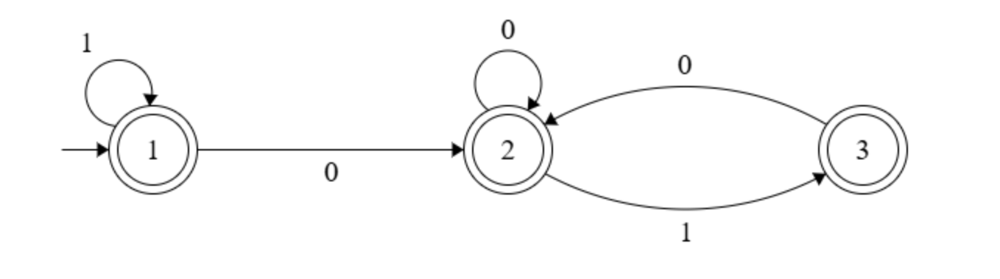

# PLC2025 - Processamento de Linguagens e Compiladores

## TPC1

**Problema:** Encontrar uma expressão regular que valide strings binárias onde a substring "011" não apareça.  

**Resposta no formato das aulas:** ^1*(0|10)*1?$  

**Resolução:** Para bloquear a substring "011" foi preciso controlar o que pode aparecer logo a seguir a um '0'. Para visualizar a lógica, comecei por desenhar o autómato que modela este problema, que ficou com este aspeto:  
  
Ao analisar os caminhos e transições deste autómato, traduzi a ideia para a expressão regular final e confirmei o resultado no regex101.  

